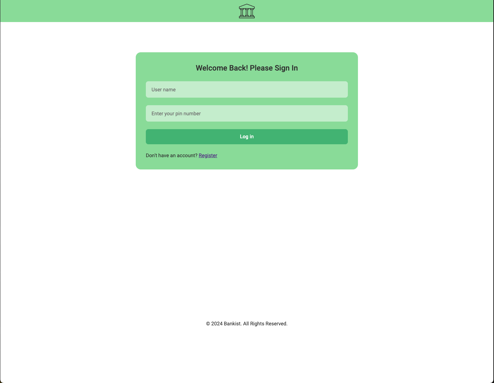
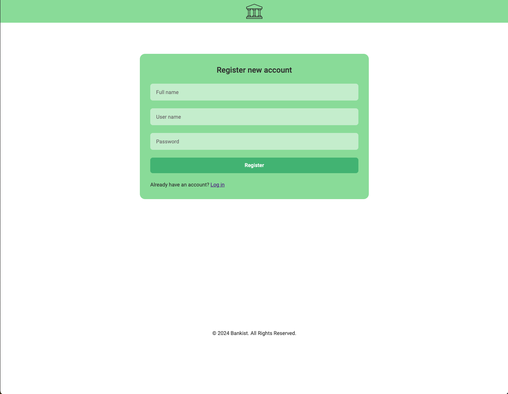
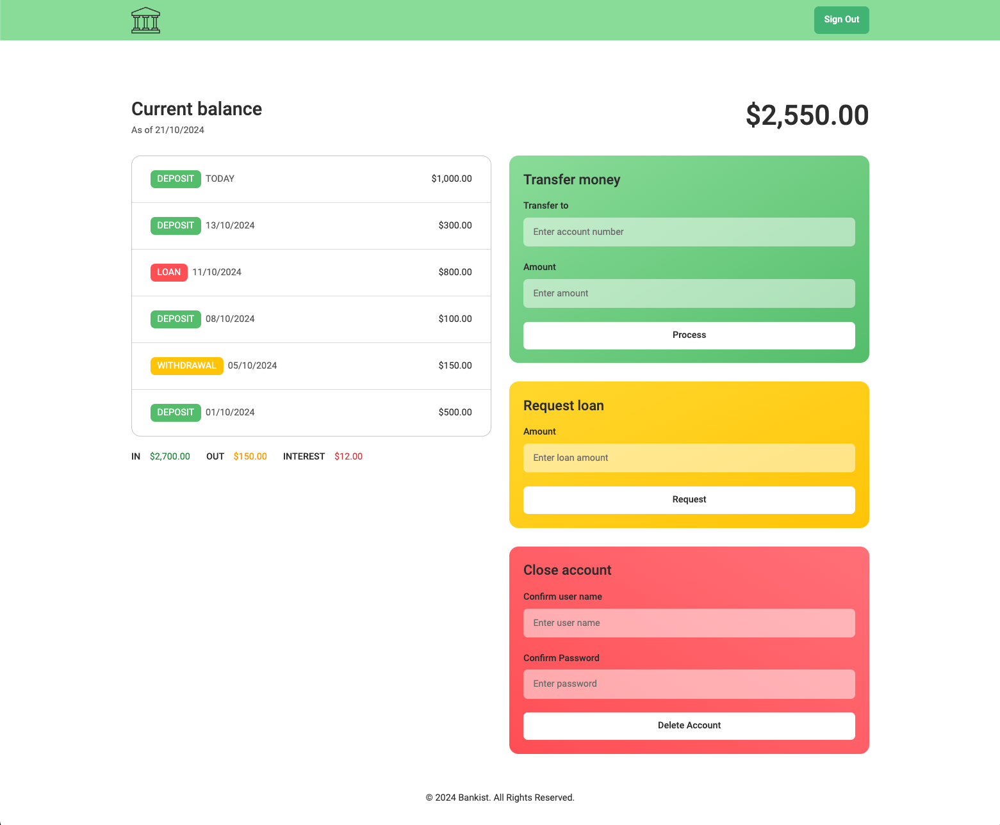

# FEWD-FINAL-PROJECT

## Simple Bankist App

[Github Repo](https://github.com/irenenguyen1017/fewd_final_project)

[Bankist Website](https://irenenguyen1017.github.io/fewd_final_project/login.html)

### Overview

The Simple Bankist App is a web application designed to simulate core banking operations. Developed using vanilla JavaScript, HTML, and CSS, the app offers an intuitive and responsive interface where users can manage their finances, similar to a real-world bank. It provides seamless banking features while ensuring a smooth user experience across different devices.

#### Key Features

- **Account Management**: Users can register a new account, log in, and close their account.
- **Fund Transfers**: Users can securely transfer money between accounts.
- **Loan Facility**: Borrow money from the bank with automated interest calculations.
- **Transaction History**: Keep track of deposits, withdrawals, and loans.
- **Balance Overview**: View current balance, including a summary of income, expenses, and interest earned on loans.

### Project Structure

#### Pages

The app consists of three main pages:

- **Login**: Allows existing users to log into their account.



- **Register**: Enables new users to create an account with the bank.



- **Dashboard**: Displays the user’s current balance, transaction history, and available banking operations like transfers and loans.



#### CSS Styling

- **CSS Variables**: Utilizes :root to define a scalable and reusable design system, managing colors, font sizes, and spacing for easy theming.
- **Responsive Design**: Uses Flexbox, Grid, and Media Queries to ensure a fluid, responsive layout on all device sizes.

#### JavaScript Functionality

- **Data Storage**: Implements localStorage to handle user data and persist session information. The app simulates a backend by storing user accounts, transaction histories, and balances locally.

- **Code Organization**:
  - **Business Logic**: Responsible for core functionalities such as user authentication, handling bank operations (e.g., transfers, loans), updating balances, and managing transaction histories.
  - **UI Interaction**: Dynamically updates the DOM to reflect user actions in real-time (e.g., balance updates, transaction lists, login/logout states).

### Test Accounts

Here are some test accounts you can use to log in and explore the app:

| Username    | PIN  | Account Number |
|-------------|------|----------------|
| user1       | 1111 | 123456         |
| user2       | 2222 | 234567         |
| user3       | 3333 | 345678         |

#### Get started

> Clone Repository

```
git clone git@github.com:irenenguyen1017/fewd_final_project.git
```

> Start Local Server

```
npm start
```


